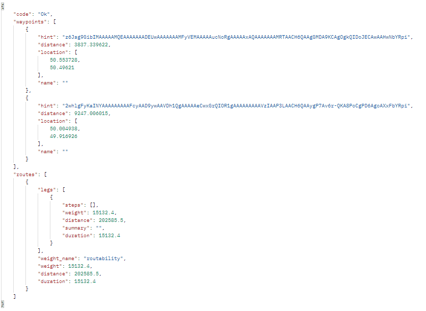

# A guide to finding and using public API's

### Motivation
An API, or Application Programming Interface, allows for communication between two application. In the case of this guide this is mostly between a website and an external server. This is most often used for completing an action or accessing external data. This skill allows for a much greater range of functionality within a website without largly increasing the processing power required for the site. This means it will likely run the same on any device, such a phone, that will have much less processing power to complete everything internally. The only downside is that it will require an internet connection in order to be able to process the requests. However, code can be added to run when the API can not reach the destination meaning the webstie can continue to function.

### Background
The code for the API's will require no prior knowledge but in order to implement this code a basic understanding of HTML and JavaScript will be required. A video that explains a lot of these basics can be found [here](https://www.youtube.com/watch?v=wrdR5Su_Stg). This will be required to set up a basic website as well as link the script to the HTML. Overall, the guide will be aimed at beginners who are just starting to use API's, aiming to explain a lot of what the code is used for as well as ways to search for API's to use.

### Learning resources
Christopher Okhravi, The absolute basics of HTML, CSS and JavaScript https://www.youtube.com/watch?v=wrdR5Su_Stg (26th September, 2013)

### Evaluation
Overall, using API's is a relatively easy skill to learn, especially compared to the vast array of functions that there are publicly available API's for, allowing for a wide range of uses. The alternative is to hard code these functions within the website. The benefit of hard coding is that the code will be able to run on the site without an internet connection. Accessing the website will often require a connection though if it is stored on a web server meaning this is only useful when refreshing the page. Writing the code can often require a deeper knowledge of coding using JavaScript as well as a full understanding of the problem and how to tackle it, making this process very difficult. On top of this, the code will take time to run meaning the site can have variable response times depending on the type of device and it's computing power.

### Guide
##### Finding
Often the best place to start when find an API is Google. For example, by searching for [distance between two points api](https://www.google.com/search?q=distance+between+two+points+api&oq=distance+between+two+points+api&aqs=edge..69i57j0i22i30l8.9560j0j1&sourceid=chrome&ie=UTF-8&safe=active) a list of possible sources of the API will come up. There will potentially be, especially for requests that might be more common, a lot of different sites and providers for the same functionality. The first result that comes up for this is on the Google developer site for the [Google Maps Platform](https://developers.google.com/maps/documentation/distance-matrix/overview) with their distance matrix API. While this can seem the obvious choice as Google is a company that a lot of people will have heard of and is likely a reputable source, a closer inspection of the pages tells that they have a charge for using the API. While this is ok for larger companies looking to use it as it will probably be more powerfull than the alternatives this is not a realisticaly usable source for a smaller developer that will not have a source of income from the site. In this case you will have to move further down the results list or search for similar operations until an API can be found that fits your criteria.

Finding an API that does exactly what you want can often be tough, especially for requests that are less common. This means that sometimes you will have to find one to use that does not do exactly what you want but returns values that can be adapted into what you want, or one that does something different but will still fit the site being made and the functionality can be changed. In the case that you need it do something very specific that you can not find an API for it is possible for you to write your own however this willl not be covered in this guide and requires some more advanced knowledge.

##### Using

The first thing to do when using an API you have found is to find its documentation, often outlining the required request URL as well as the parameters needed. In some cases this will also contain example requests that will help you to write your own.

The first step to calling the request is to create a JavaScript file to contain the code. It is best to put the request within a function as this will allow you to call it when you need it, as well as pass variables into the function to easily edit the request. Start by adding the line:

    const Http = new XMLHttpRequest();

An XMLHttpRequest is an object that can be used to service a request after the page has loaded, more information on which can be found [here](https://www.w3schools.com/xml/xml_http.asp). You can then define the URL using:

    const url = "URL";

setting the URL to whatever the documentation says to use, often the URL of the site followed by a series of identifiers seperated by /'s but this can vary between different sources.

Finally the request can be open and sent using:

    Http.open("GET", url);
    Http.send();

In order to recieve the results the code needs to run when the response has been recieved which can be achieved using:

    Http.onreadystatechange=e=>{
    
    }

which is saying that, when the onreadystatechange is triggered (when the response reaches the device) it calls 'e' which will be all of the code within the brackets. This ensures that the data is there when you later try to read it.

In order to read the data it must be first converted into a JSON (Java Script Object Notation) object. JSON being a standard format for data and often used in transmitting data over web applications. This can be done using:

    JSONobj = JSON.parse(Http.responseText);

It can sometimes be difficult to find the variable that you want from the JSON as they will often contain a lot of information that is not useful. By using a tool such as [postman](https://web.postman.co/) you can easily send test requests to the URL and view the response in an easy to read manner.

Alternatively, the JSON Object can be viewed using the line:

    console.log(JSONobj)

after the variable JSONobj has been defined where it can be then be viewed in the console, accesible by pressing F12 and going to the console tab. From here, it is easiest to copy and paste the JSON into a JSON viewer such as [this one](https://codebeautify.org/jsonviewer) to make it easier to find the data you want. Some more detailed explanation on getting the values from the JSON object can be found [here](https://idratherbewriting.com/learnapidoc/docapis_access_json_values.html) but the basic idea is that each time you go a layer deeper into the object you will add a . and then the 'key', or identifier, for the section. It is important to remember that items within {} are normal but if the section is within [] then it is held in an array and a location will have to be provided. This will most often be by using a [0] directly after the key but it can change depending on the response.

For example, getting the value of distance from 

is:

    distance = JSONobj.routes[0].legs[0].distance;

Having got these values, the best thing to do is to call a function within the 'onreadystatechange' that does something with these variables. This is because this is whats known as asyncronous programming meaning it is not running in time with the main thread. As it has to wait for the response from the server, by the time it has the variables the main thread has progressed past the point where variables are being returned to, likely causing errors in you code. By calling a new function it will be in time with the response and ensures it has the data required.

If you desperately need to return the values it is possible to force the programme to be syncronous, or all on the main thread, but this will require modifying a bit of code and is not recommended as it can slow down programmes and uses code that has been deprecated, meaning there is now less support for it and it has a chance to being removed with future versions of web browsers.

If you still want to do this you must replace the line:

    Http.open("GET", url);

with:

    Http.open("GET", url, false);

and replace:

    Http.onreadystatechange=e=>{

with:

    if(Http.status === 200){

From there you do the rest as normal and can use:

    return('variable name')

to return the variables.